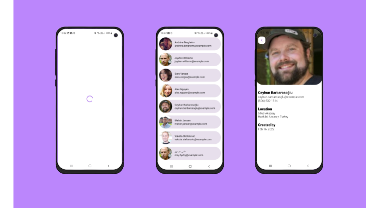

Vlue Challenge App
==================

**Vlue Challenge** is a fully functional Android app built entirely with Kotlin and Jetpack Compose. This
Follows Android design and development best practices.

## Tech stack & Open-source libraries

- Minimum SDK level 24
- Kotlin based, Coroutines flow + StateFlow for asynchronous.

- **Jetpack**
    - Compose: A modern toolkit for creating a native android UI
    - Lifecycle: Observe Android lifecycles and handle UI states upon the lifecycle changes.
    - ViewModel: Manages UI-related data holder and lifecycle aware. Allows data to survive configuration changes such as screen rotations.
    - Hilt: for dependency injection.

- **Architecture**
    - MVVM Architecture (View - ViewModel - Model)
    - Module Pattern
    - Repository Pattern
  
- **Retrofit2 & OkHttp3:** Construct the REST APIs and paging network data.
- **Gson:** A modern JSON library for Kotlin and Java.

## Screenshots

## Architecture

The **Vlue Challenge** app follows the
[official architecture guidance](https://developer.android.com/topic/architecture)
and is described in detail in the.

[architecture learning journey](docs/Architecture.md).

## Modularization

The **Vlue Challenge** app has been fully modularized and you can find the detailed guidance and
description of the modularization strategy used in.

[modularization learning journey](docs/Modularization.md).
