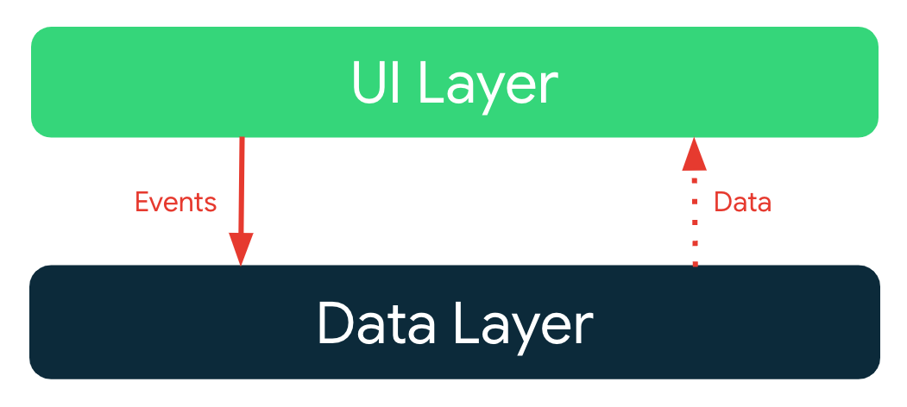
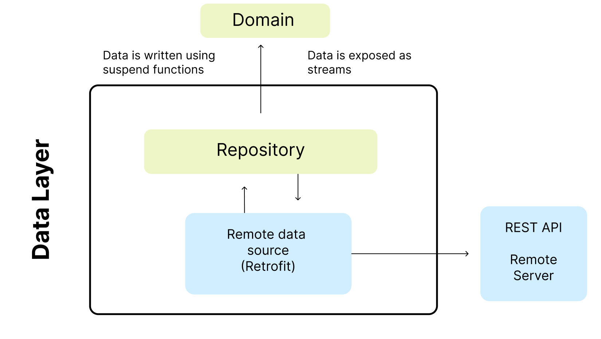

# Architecture Learning Journey

In this learning journey you will learn about the Vlue Challenge app architecture: its layers, key classes and the interactions between them.

## Goals and requirements

The goals for the app architecture are:

*   Follow the [official architecture guidance](https://developer.android.com/jetpack/guide) as closely as possible.
*   Easy for developers to understand, nothing too experimental.
*   Support multiple developers working on the same codebase.
*   Minimize build times.

## Architecture overview

The app architecture has two layers: a [data layer](https://developer.android.com/jetpack/guide/data-layer) and [UI layer](https://developer.android.com/jetpack/guide/ui-layer)

The architecture follows a reactive programming model with [unidirectional data flow](https://developer.android.com/jetpack/guide/ui-layer#udf). With the data layer at the bottom, the key concepts are:

*   Higher layers react to changes in lower layers.
*   Events flow down.
*   Data flows up.

The data flow is achieved using streams, implemented using [Kotlin Flows](https://developer.android.com/kotlin/flow).

## Data layer

The data layer is implemented to connect to our web service, in this case it is the source for the application's data.

The repository has its own model. For example, the `Value Repository` has a `Value Response` model.

Repositories are the public API for other layers, they provide the _only_ way to access the app data. The repositories typically offer one or more methods for reading and writing data.

## UI Layer

The [UI layer](https://developer.android.com/topic/architecture/ui-layer) comprises:

*   UI elements built using [Jetpack Compose](https://developer.android.com/jetpack/compose)
*   [Android ViewModels](https://developer.android.com/topic/libraries/architecture/viewmodel)

The ViewModels receive streams of data from repositories and transform them into UI state. The UI elements reflect this state, and provide ways for the user to interact with the app. These interactions are passed as events to the view model where they are processed.

### Modeling UI state

UI state is modeled as a sealed hierarchy using interfaces and immutable data classes. State objects are only ever emitted through the transform of data streams. This approach ensures that:

*   the UI state always represents the underlying app data - the app data is the source-of-truth.
*   the UI elements handle all possible states.
